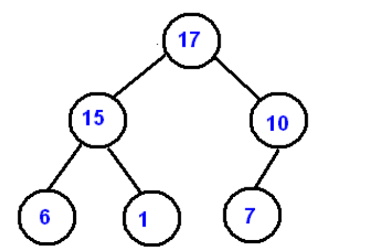

# Pyramidal Scheme _Eng._

### Description

Create a company that follows the principle of a pyramidal scheme. Use a heap for the implementation.

### Structure
- The manager must be the first element of the company (the root of the tree). Then, the employees are introduced into the heap according to their years of experience. For example, in the figure, the manager has 17 years of experience.
- Each employee has a base salary. Whenever he attracts another employee to the company (who becomes his subordinate), he receives 10% of the subordinate's total salary. So each employee will receive 10% of the total salary of his direct subordinates.
- The newest employees (who are leafs of the trees) have the total salary equal to that of the base salary (without bonus).
- For example :
	- Employee 6: base salary = total salary = 1000
	- Employee 1: base salary = total salary = 1000
	- Employee 15: base salary = 2000, total salary = 2000 + 200 = 2200
	- Employee 10: base salary = 2000, total salary = 2000 + 100 = 2100
	- Employee 17: base salary = 4000, total salary = 4000 + 220 + 210 = 4430

### Observations:
- Experience has been chosen as the criterion for placing the employees in the heap. This is at your choice (you can use the name or any other field that you think is more desirable).
- Nodes located on the same level (ex: 6, 1, 7) must have the same base salary.

### Tasks
1. Create the class / struct Employee with the fields: name, first name, base salary, total salary, experience. Add the necessary constructors and methods.
2. Create objects of type Employee and save them in the heap. Be careful to update the values ​​of the total salaries of employees after each insertion.
3. Use an algorithm to display the information of all employees by level.
4. Implement three possible instructions that can be entered from the keyboard:
- Instruction 1: Show if the company is whole or not. It is said that the business is whole if all the nodes of the tree have zero or two sons.

```
Ex: 1 (we introduce 1)
The business is not complete.
```

 - Instruction 2: Change the manager.Remove the root and put another manager in his place (among the employees). Recalculate all salaries after this operation!
 
 - Instruction 3: If X and Y are in conflict, a common ancestor must resolve the conflict. We must determine the closest common ancestor of X and Y.

```
Ex: 3 6 10
The closest superior who can resolve the conflict is 17.
```


# Figure


# Schéma Pyramidal _Fr._

### Description

On veut simuler le principe de la « Vente pyramidale » d'une compagnie. Utiliser un tas pour l'implémentation de ce principe.

### Structure
- Le manager doit être le premier élément de la compagnie (la racine de l'arbre). Ensuite, les employés sont introduits dans le tas selon leurs années d'expérience. Par exemple, dans la figure, le manager a 17 années d'expérience.
- Chaque employé a un salaire de base. Chaque fois qu'il attire un autre employé dans l'entreprise (qui devient son subordonné), il reçoit 10% du salaire total de son subordonné. Donc, chaque employé va recevoir 10% du salaire total de ses subordonnées directs. 
- Les employées les plus nouveaux (les feuilles
de l'arbre) ont le salaire total égal avec celui de base (sans bonus).
- Par exemple :
	- Employé 6 : salaire base = salaire total = 1000
	- Employé 1 : salaire base = salaire total = 1000
	- Employé 15 : salaire base = 2000, salaire total = 2000+200 = 2200
	- Employé 10 : salaire base = 2000, salaire total = 2000+100 = 2100
	- Employé 17 : salaire base = 4000, salaire total = 4000 + 220 + 210 = 4430

### Observations:
- On a choisi l'expérience comme critère d'appel des instructions. C'est à votre choix (vous pouvez utiliser le nom ou tout autre champ qui vous semble plus souhaitable).
- Les Nœuds situes sur le même Niveau (ex: 6, 1, 7) doivent avoir le même salaire de base.

### Les Tâches
1. Créer la classe/struct Employe avec les champs: nom, prénom, salaire de base, salaire total, expérience. Ajoutez les constructeurs et les méthodes nécessaires.
2. Créer des objets de type Employe et sauvegardez-les dans le tas. Soyez attentifs pour actualiser les valeurs des salaires totales des employés après chaque insertion.
3. Utilisez un algorithme pour afficher les informations des tous les employés par niveau.
4. Implémentez trois instructions possibles qui peuvent être introduites du clavier :
	- Instruction 1 : Afficher si notre entreprise est entière ou non. On dit que l'entreprise est entière si tous les Noeuds de l'arbre ont zéro ou deux fils. 
	``` 
	Ex : 1 (on introduit 1 du clavier)
	L'entreprise n'est pas entière.
	```

 	- Instruction 2 : Changer le manager. Effacer donc la racine et mettre un autre manager a sa place (parmi les employées). Recalculer tous les salaires après cette opération !
 	
 	- Instruction 3 : Si X et Y sont en conflit, un patron commun doit résoudre le conflit. On doit déterminer le plus proche ancêtre commun des X et Y.

	 ```
	 Ex : 3 6 10
	 Le plus proche patron qui peut résoudre le conflit est 17.
	 ``` 
