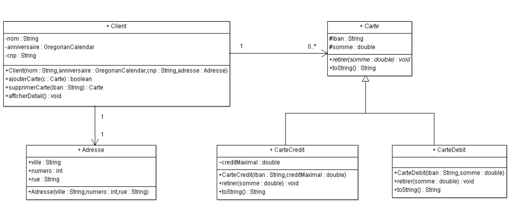

# Bank Client _Eng._

**Requirements**

Create classes according to the following diagram. Also, create a test class to implement all the functions that were created.

# Diagram _(Fr. Diagramme)_

# Un client de la banque
**Les Tâches**

Créez des classes selon le diagramme suivant. Créez également une classe de test pour implémenter toutes les fonctions créées.
