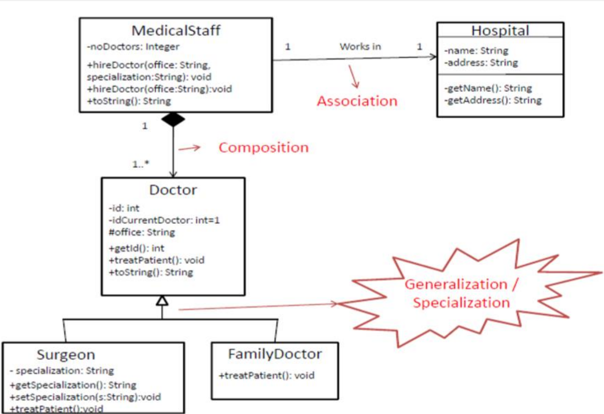

# Hospital _Eng._
**Description**

Create classes, according to the following diagram.

**Requirements**

Create a test class, ManageHospitalSystem.

# Diagram _(Fr. Diagramme)_

# Hôpital _Fr._
**Description**

Mettez en œuvre les classes de la
diagramme suivante.

**Les Tâches**

Mettez en œuvre une classe de test,
ManageHospitalSystem, pour les tester.
