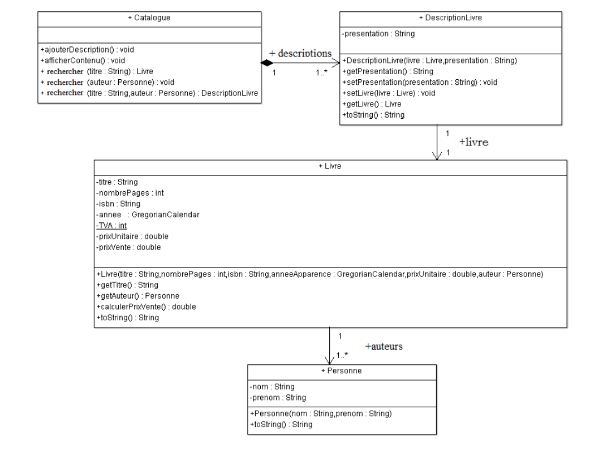

# Library _Eng._
**Description**

Books are sold in a library. Every book has the following informations:
- Title
- Author
- Desription
- Number of pages
- Unique code (ISBN)
- Apparition date
- Price per unit

10 % of the unit price is added to obtain the selling price for every book.
The descriptions of the books are held in a catalog and is given as help for the clients.
See the diagram for more details. 

**Requirements**
Write a program that executes the following functions:
1. Add description for every book in the catalog
2. Search a book by one or two criterias (title, author) and print all books that correspond at those criterias
3. Print all the details of the catalog
4. Add needed constructors, setters and getters

# Diagram _(Fr. Diagramme)_

# Bibliothèque _Fr._
**Description**

Dans une librairie on vend des livres. Chaque
livre contient les informations suivantes:
- Titre
- Auteur
- Description
- nombre de pages
- ISBN unique
- Année d’apparition
- Le prix unitaire

Au prix unitaire nous ajoutons 10% (la valeur TVA)
et nous obtenons le prix de vente pour chaque
livre. Les descriptions des livres sont contenues
dans un catalogue offert pour consultation aux
clients. (voir le diagramme)

**Les Tâches**
Ecrivez un programme qui exécute les
fonctions suivantes:
1. Ajoute les descriptions de tous les livres dans le
catalogue
2. Recherche par un ou deux critères (titre, auteur) et
affiche les livres qui répondent à ces critères
3. Affiche le contenu du catalogue
4. Ajouter les constructeurs, accesseurs et
mutateurs nécessaires.
