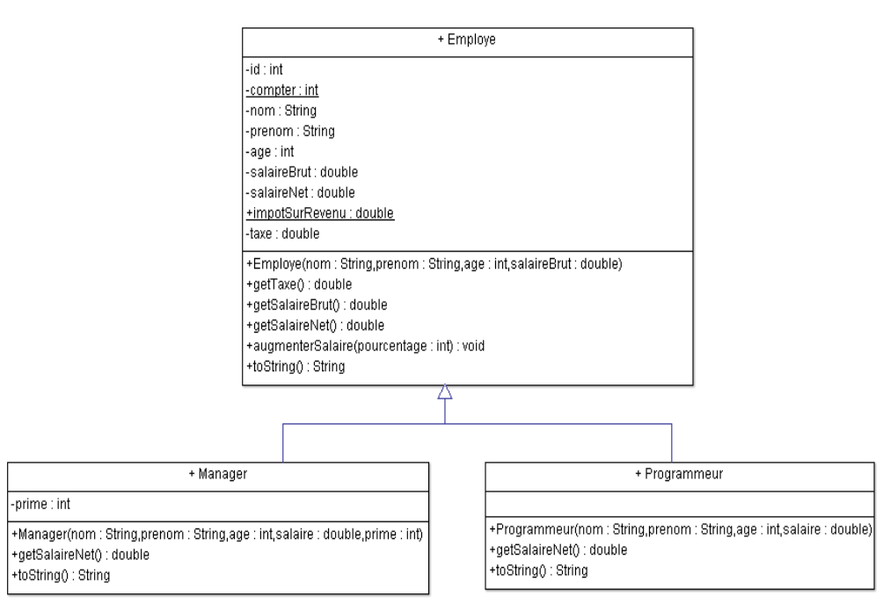

# Employee _Eng._
**Requirements**

Create classes according to the following diagram.
Also, create a test class to implement all the functions that were created.

**Info**

To calculate the net salary:
- for the employee basic taxes will be paid and also he will have to pay the tax on revenue. 
- the programmer will only pay the basic taxes
- the manager will pay similar taxes as the employee but he will also pay tax on the prime.

Tax = taxes for health, unemployment, pension (wage costs)
# Diagram _(Fr. Diagramme)_

# Employé _Fr._
**Les Tâches**

Créez des classes selon le diagramme suivant.
Créez également une classe de test pour implémenter toutes les fonctions créées.

**Info**

Pour calculer le salaire net:
- pour l'employé : les taxes seront payées;
ensuite il va payer l'impôt sur le revenu
- pour le programmeur: il ne paiera que les
taxes
- pour le Manager: la méthode de calcul du
salaire net similaire a celle de l‘employé sera
utilisée, mais il va aussi payer des taxes pour la
prime

Taxe = des taxes pour la santé, le chômage, la
pension (charges salariales)
